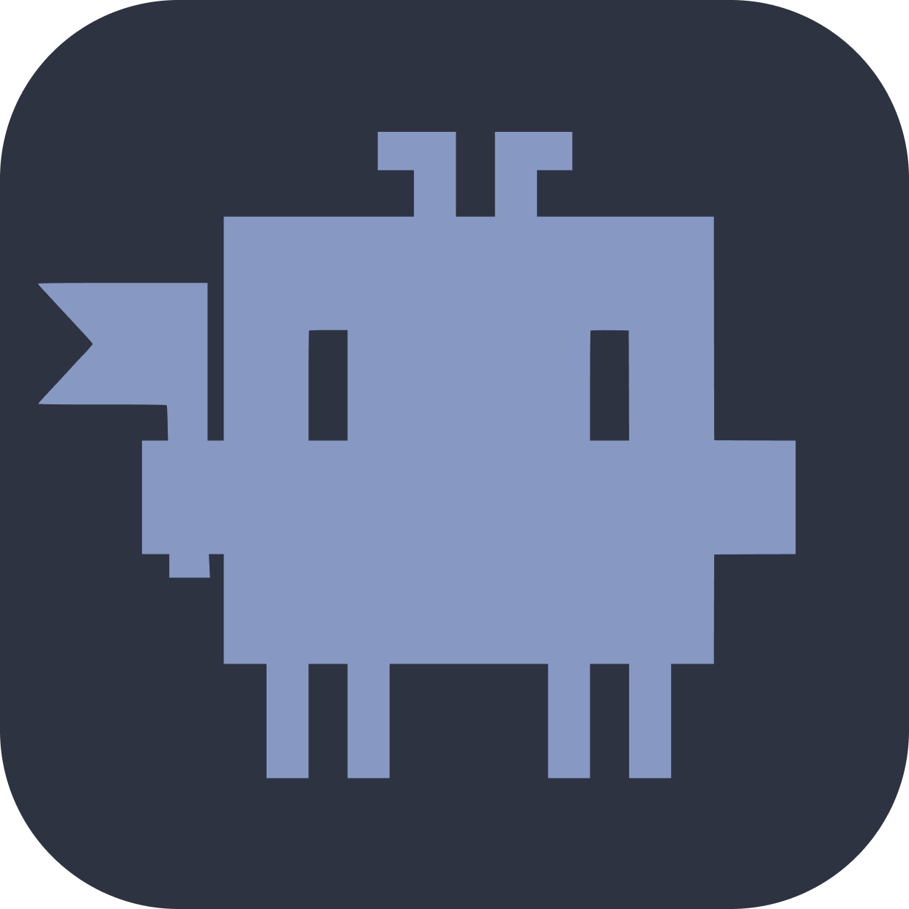

<p align="center">
  
</p>

<h1 align="center">Kraube Kode</h1>

<p align="center">
  Desktop GUI для <a href="https://docs.anthropic.com/en/docs/claude-code">Claude Code</a>
</p>

<p align="center">
  <a href="https://github.com/scott-walker/kraube-kode/releases/latest">
    
  </a>
  <a href="https://github.com/scott-walker/kraube-kode/releases/latest">
    
  </a>
  <a href="LICENSE">
    
  </a>
</p>

---

Kraube Kode — полноценное десктопное приложение для работы с Claude Code. Вместо терминала — продуманный интерфейс с подсветкой синтаксиса, diff-блоками, управлением сессиями и системой тем.

## Возможности

- **Streaming-чат** — ответы Claude отображаются в реальном времени
- **Inference-блоки** — tool use, результаты выполнения, approval-запросы
- **Diff-блоки** — подсветка изменений кода с синтаксис-хайлайтингом
- **Управление сессиями** — пул соединений, несколько параллельных сессий
- **Темы** — светлая и тёмная, на CSS custom properties
- **Настройки** — подключения, общие параметры, всё персистируется в SQLite
- **Copy-to-clipboard** — копирование блоков кода одним кликом

## Установка

### Linux

Скачайте последний релиз со [страницы Releases](https://github.com/scott-walker/kraube-kode/releases/latest):

**Debian / Ubuntu** (.deb):
```bash
sudo dpkg -i kraube-kode_*_amd64.deb
```

**Fedora / RHEL** (.rpm):
```bash
sudo rpm -i kraube-kode-*.x86_64.rpm
```

### Требования

- Установленный [Claude Code CLI](https://docs.anthropic.com/en/docs/claude-code)
- Активный API-ключ Anthropic или авторизация через `claude login`

## Разработка

```bash
# Клонирование
git clone git@github.com:scott-walker/kraube-kode.git
cd kraube-kode

# Установка зависимостей
npm install

# Запуск в dev-режиме
npm start

# Сборка дистрибутива
npm run make
```

### Стек

- **Runtime**: Electron
- **Frontend**: React, CSS custom properties
- **Backend**: Node.js, [@scottwalker/kraube-konnektor](https://www.npmjs.com/package/@scottwalker/kraube-konnektor)
- **Storage**: SQLite (better-sqlite3)
- **State**: Zustand

### Архитектура

Проект следует 12 архитектурным принципам, документированным в [`docs/architecture/`](docs/architecture/).

## Лицензия

[MIT](LICENSE)
